# MR3002B-Mechatronics-Systems

# Simulink Stateflow Logic Documentation

This document explains the logic of the different simulations, inspired by Simulink's Stateflow diagrams.

## Traffic Light Simulation

The traffic light simulation mimics the behavior of a standard traffic light system.

### Stateflow Diagram

### States

*   **Standby:** This is the initial state. All traffic lights are off. The system waits for a "Turn On" event to start the simulation.
*   **Green:** The green light is on, allowing traffic to proceed.
*   **Yellow:** The yellow light is on, indicating that the light is about to change to red.
*   **Red:** The red light is on, stopping traffic.

### Transitions

*   **Standby -> Green:** When the system is turned on, it transitions to the Green state.
*   **Green -> Yellow:** After 10 seconds in the Green state, it transitions to the Yellow state.
*   **Yellow -> Red:** After 3 seconds in the Yellow state, it transitions to the Red state.
*   **Red -> Green:** After 7 seconds in the Red state, it transitions back to the Green state, completing the cycle.
*   **Green/Yellow/Red -> Standby:** At any point, if the system is turned off, it returns to the Standby state.

## Air Conditioning Simulation

The air conditioning simulation controls the AC based on user settings and ambient temperature. It can operate in two modes: Manual and Automatic.

### Stateflow Diagram

```mermaid
stateDiagram-v2
    state "Manual Mode" as Manual {
        state "AC Off" as M_Off
        state "AC On" as M_On
        M_Off --> M_On : User turns ON
        M_On --> M_Off : User turns OFF
    }

    state "Automatic Mode" as Auto {
        state "AC Off" as A_Off
        state "AC On" as A_On
        A_Off --> A_On : Temp > 25°C
        A_On --> A_Off : Temp <= 25°C
    }

    [*] --> Manual
    Manual --> Auto : Switch to Auto
    Auto --> Manual : Switch to Manual
```

### Modes

*   **Manual:** The user has direct control to turn the AC on or off.
*   **Automatic:** The system automatically controls the AC based on the ambient temperature.

### States

*   **AC Off:** The air conditioning is off.
*   **AC On:** The air conditioning is on.

### Conditions and Transitions

*   **Mode Switching:** The user can switch between **Manual** and **Automatic** modes at any time.
*   **In Manual Mode:**
    *   The AC transitions to the **On** state when the user turns it on.
    *   The AC transitions to the **Off** state when the user turns it off.
*   **In Automatic Mode:**
    *   The AC transitions to the **On** state if the ambient temperature rises above 25°C.
    *   The AC transitions to the **Off** state if the ambient temperature is 25°C or below.
    *   The system continuously checks the temperature and adjusts the AC state accordingly.

## Cruise Control Simulation

The cruise control simulation mimics a vehicle's cruise control system. It allows the driver to set a target speed, which the system will then maintain. The driver can temporarily override the set speed by accelerating.

### Stateflow Diagram

### States

*   **CruiseOff:** The cruise control system is inactive. The vehicle's speed is controlled manually by the driver's accelerator input.
*   **CruiseOn:** The cruise control system is active and has two sub-states:
    *   **MaintainingSpeed:** The system is actively maintaining the vehicle's speed at the pre-set `targetSpeed`.
    *   **TempOverride:** The driver has pressed the accelerator, temporarily increasing the speed above the `targetSpeed`. The system is momentarily overridden but remains active.

### Transitions and Conditions

*   **CruiseOff -> CruiseOn:** When the driver activates the cruise control, the system transitions to the **CruiseOn** state. The `currentSpeed` at the moment of activation is set as the `targetSpeed`, and the system enters the **MaintainingSpeed** sub-state.
*   **CruiseOn -> CruiseOff:** The driver can deactivate the system at any time, causing it to transition back to the **CruiseOff** state.
*   **MaintainingSpeed -> TempOverride:** While in **CruiseOn** mode, if the driver presses the accelerator (represented by increasing the slider value), the system transitions to the **TempOverride** sub-state. The vehicle's speed will increase.
*   **TempOverride -> MaintainingSpeed:** When the driver releases the accelerator, the system automatically reduces the speed back to the `targetSpeed` and returns to the **MaintainingSpeed** sub-state.

## Elevator Simulation

The elevator simulation models the behavior of an elevator in a 3-story building. It can move between floors based on user requests and includes an emergency stop feature.

### Stateflow Diagram

### States

*   **Stopped:** The elevator is idle at a floor, waiting for a request.
*   **MovingUp:** The elevator is ascending to a higher floor.
*   **MovingDown:** The elevator is descending to a lower floor.
*   **Emergency:** The elevator has been halted by the emergency button. It is inactive and will not respond to floor requests until reset.

### Transitions and Conditions

*   **Stopped -> MovingUp/MovingDown:** When the elevator is **Stopped** and a floor is requested, it transitions to **MovingUp** or **MovingDown** depending on the location of the requested floor relative to the current one.
*   **MovingUp/MovingDown -> MovingUp/MovingDown:** When the elevator is moving, it travels one floor at a time. If it arrives at a floor that is not its final destination, it remains in the `Moving*` state and continues its journey.
*   **MovingUp/MovingDown -> Stopped:** When the elevator arrives at the floor that was its target destination, it transitions to the **Stopped** state and waits for new requests.
*   **Any State -> Emergency:** If the emergency button is pressed at any time, the elevator will immediately enter the **Emergency** state, cancelling all current movements and requests.
*   **Emergency -> Stopped:** After an emergency stop, pressing the reset button will return the elevator to the **Stopped** state, ready to accept new requests.